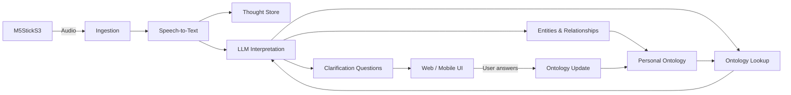

# on7o

**A personal thought-capture device that incrementally builds a structured ontology of its user's knowledge.**

on7o is not intended to be a voice assistant.

The physical device has one primary job: **capture thoughts with as little friction as possible and send them to a server**.

The server converts those thoughts to text, interprets them with an LLM, relates them to an evolving personal ontology, and identifies what it still does not understand. Instead of interrupting the user in the moment, on7o stores those ambiguities as **clarification questions** that can be answered later through a web or mobile interface.

Over time, those answers allow on7o to build an increasingly rich semantic model of the people, organizations, projects, concepts, events, decisions, and relationships that make up the user's world.

> The goal is not merely to remember what was said. The goal is to progressively understand what the user means.

---

## Why **on7o**?

**on7o is pronounced _onTo_.**

The name is a wordplay on **ontology**, a term derived from the Greek **_ón / óntos_** (ὄν / ὄντος), the present participle of **_einai_** — “to be” or “to exist” — and **_logia_** (λογία), “study” or “discourse.” In that sense, ontology is literally concerned with **that which is**, **being**, or **the study of what exists**.

The project name compresses that idea into its core ambition. The **T** in **onto** becomes **7**, using seven as a symbol of perfection or completeness within the project's naming metaphor:

> **onto** — that which is  
> **on7o** — a *perfect description of that which is*

This is intentionally aspirational. on7o does not assume that an LLM already knows the user's world, nor that its first interpretation is correct. Instead, it approaches that “perfect description” asymptotically: every captured thought, resolved ambiguity, relationship, correction, and clarification makes the model of the user's world a little more precise.

The name therefore reflects both the **ontological foundation** of the project and its long-term goal: to construct an increasingly faithful, explicit, machine-readable description of the entities and relationships that constitute the user's knowledge and lived context.

---

## Core idea

Most personal knowledge systems require the user to organize information explicitly: create a note, choose a folder, add links, define tags, or maintain a graph.

on7o starts from a different assumption:

**thought capture should be easier than thought organization.**

The user speaks naturally whenever something is worth remembering. The system captures the thought first and performs the organizational work later.

A thought may initially be no more than a digital post-it. For example:

> "Dentist appointment for Ana."

on7o does **not** need to schedule anything.

Instead, it may recognize that `Ana` is an entity that does not yet exist in the personal ontology and create a clarification question such as:

> **Who is Ana?**

After the user answers, future thoughts mentioning Ana can be interpreted using that context.

The ontology grows incrementally through this loop.

---

## A thought receptor, not a voice assistant

The on7o device is intentionally simple.

It is primarily an **input device**.

It should:

- capture the user's voice;
- provide a low-friction push-to-talk interaction;
- transmit captured audio to the backend;
- tolerate intermittent connectivity where possible;
- give minimal feedback needed to confirm capture and transmission.

It is **not** intended to:

- answer the user with generated speech;
- become a conversational voice assistant;
- schedule meetings or appointments by itself;
- execute actions merely because they were mentioned;
- require the user to classify or organize a thought before capturing it.

The device should disappear into the thought-capture process as much as possible.

---

## From thoughts to a personal ontology

Each captured thought becomes an observation that can contribute to a larger knowledge graph.

The backend should attempt to identify, among other things:

- **entities** — people, companies, projects, products, places, concepts;
- **entity types** — person, organization, project, event, decision, etc.;
- **relationships** between entities;
- **statements and claims** made by the user;
- **intentions** and things the user wants to remember;
- **events** and relevant temporal context;
- **decisions** being considered or already made;
- **topics** and areas of interest;
- **references** to previously known entities;
- **unknown or ambiguous concepts** that require clarification.

The LLM should not simply generate a summary and discard the structure behind it.

Its interpretation should be reconciled with the existing ontology.

Conceptually:

```text
thought
  -> transcription
  -> semantic interpretation
  -> ontology lookup
  -> entity / relationship extraction
  -> ambiguity detection
  -> clarification questions
  -> user answers
  -> ontology update
```

---

## Clarification is a first-class feature

A central idea in on7o is that **not understanding something is useful information**.

When the LLM encounters an entity, relationship, term, or context that cannot be resolved confidently, the system should record that uncertainty instead of inventing an answer.

The system can then ask the user targeted questions later.

Examples:

- Who is Ana?
- What is Ana's relationship to you?
- Is SciCrop a company, project, customer, or something else?
- What is your relationship to SciCrop?
- When you say "the board," which board are you referring to?
- Is this M&A discussion related to a possible acquisition, sale, merger, or several alternatives?
- Does this person refer to the same entity mentioned in an earlier thought?

These questions should preferably be:

- short;
- specific;
- answerable independently;
- prioritized by how much additional context they unlock;
- deduplicated when several thoughts expose the same missing knowledge.

The user should be able to answer them asynchronously through a web or mobile interface.

---

## Example: progressively learning who Ana is

### Thought 1

> "Dentist appointment for Ana."

Possible interpretation:

```text
Entity: Ana
Type: Unknown Person
Related concept: Dentist
Context: Something to remember
```

The ontology does not yet know who Ana is.

on7o creates a question:

> Who is Ana?

The user might later answer:

> Ana is my daughter.

The ontology can now evolve toward something conceptually similar to:

```text
User --parent_of--> Ana
Ana  --instance_of--> Person
```

A later thought mentioning Ana can reuse that knowledge without asking the same question again.

---

## Example: understanding a business decision

Consider the thought:

> "I need to have a SciCrop board meeting to decide the future and the M&A options."

Even if this thought is perfectly understandable to its author, a new on7o installation may know almost nothing about its context.

The LLM may initially extract concepts such as:

```text
SciCrop
Board Meeting
Strategic Decision
Future of SciCrop
Mergers & Acquisitions
```

But several important relationships may still be missing.

The system could therefore generate questions such as:

> What is SciCrop?

> What is your relationship to SciCrop?

> Which board does "board meeting" refer to?

> What M&A alternatives are currently being considered?

> Is deciding the future of SciCrop the objective of this meeting?

Each answer enriches the ontology and improves the interpretation of subsequent thoughts.

The long-term value comes from the accumulated network of context, not from any single transcription.

---

## Architecture

The initial architecture consists of three main layers.

### 1. Capture device

Initial hardware:

- **M5StickS3**
- blue button used for **push-to-talk**

Responsibilities:

- start/stop audio capture;
- package the captured audio;
- send it upstream;
- maintain a small local queue when transmission cannot happen immediately, if supported by the implementation.

The capture device does not need an LLM and does not need to generate spoken responses.

### 2. Transport / mobile bridge

Two communication paths are envisioned.

**Initial implementation**

```text
M5StickS3 --Wi-Fi--> local Java/Spring Boot server
```

This minimizes the number of moving parts during early development.

**Later mobile architecture**

```text
M5StickS3 --Bluetooth--> Android phone --Internet--> server
```

The Android phone acts primarily as a connectivity bridge and user interface for reviewing thoughts and answering clarification questions.

### 3. Knowledge backend

The backend is responsible for the intelligence of the system.

A conceptual pipeline is:



---

## Processing model

A captured thought should ideally pass through several distinct stages.

### 1. Capture

The user presses the button and speaks freely.

### 2. Ingestion

The server receives the audio and creates an immutable thought event with timestamps and technical metadata.

### 3. Speech-to-text

The audio is transcribed.

The original transcription should remain available even if later semantic interpretations change.

### 4. Semantic interpretation

An LLM analyzes the thought in the context of the existing personal ontology.

The output may include:

- detected entities;
- candidate entity matches;
- relationships;
- events;
- intentions;
- statements;
- decisions;
- topics;
- temporal references;
- confidence or uncertainty;
- unresolved references.

### 5. Ontology reconciliation

Extracted concepts are compared with what is already known.

The system should distinguish between:

- a known entity;
- a probable match;
- a new entity;
- an ambiguous reference;
- a concept that requires additional definition.

### 6. Clarification generation

Missing context is converted into explicit questions.

These questions are persisted instead of requiring an immediate conversation.

### 7. Human clarification

The user answers questions later through a web or mobile interface.

### 8. Ontology evolution

The answers create or modify entities and relationships in the personal knowledge model.

Previous thoughts may eventually be reinterpreted in light of newly acquired knowledge.

---

## Knowledge layers

It is useful to treat the system as several related but distinct layers of information.

### Raw thought

What was originally captured.

### Transcription

What the speech-to-text system understood from the audio.

### Interpretation

What an LLM inferred from that transcription at a particular point in time.

### Ontological knowledge

Facts, concepts, entities, relationships, and definitions that have been established over time.

### Questions / uncertainty

Things the system knows it does not yet understand.

Keeping these layers separate makes it possible to improve models and reinterpret historical thoughts without destroying the original record.

---

## Ontology

The ontology is intended to become the semantic backbone of on7o.

The current direction is to integrate with the **[Infinite Stack Ontology](https://github.com/scicrop/infinitestack-ontology)** layer.

The exact formal representation is intentionally left open while the model evolves. Technologies such as **RDF**, **OWL**, graph databases, or other semantic representations may be evaluated as implementation progresses.

The important architectural requirement is not a particular storage technology. It is that knowledge must be represented explicitly enough that the system can reason about:

- subjects;
- predicates;
- objects;
- entity identity;
- types and classes;
- relationships;
- provenance;
- time;
- uncertainty;
- conflicting assertions;
- unanswered questions.

The ontology should be able to evolve without requiring the user to design it manually upfront.

---

## Memory is not the same as truth

A personal knowledge system needs to distinguish between things the user **said**, things the system **inferred**, and things that have become sufficiently established to participate in the ontology.

For example:

```text
Captured thought:
"John may become our CTO."

is not equivalent to:
John --has_role--> CTO
```

The system should preserve provenance and modality where possible.

A more faithful representation might distinguish:

```text
User --is_considering--> [John becoming CTO]
```

from a later confirmed fact:

```text
John --has_role--> CTO
```

This distinction becomes increasingly important as the ontology grows.

---

## Design principles

### Capture first, organize later

Speaking a thought should require almost no cognitive overhead.

### Ask instead of hallucinating

When important context is missing, create a question.

### Preserve the source

A new interpretation must not erase the original thought or transcription.

### Make uncertainty explicit

Unknown relationships and ambiguous entities are part of the knowledge model.

### Human-in-the-loop ontology building

The LLM proposes structure; the user supplies missing meaning and resolves important ambiguity.

### Context compounds

Every clarification should make future interpretation better.

### No unnecessary action

A statement about something to remember is not automatically an instruction to execute it.

### Model independence

LLMs, STT engines, databases, and ontology technologies should be replaceable components where practical.

---

## What on7o is not

on7o is **not primarily**:

- a voice chatbot;
- a smart speaker;
- a task automation agent;
- a calendar assistant;
- a transcription application;
- a traditional note-taking application;
- a folder-and-tag knowledge base;
- an LLM wrapper that only summarizes recordings.

Those capabilities may intersect with the project in the future, but they are not the central idea.

The central idea is:

> **Capture unstructured human thought and progressively turn it into structured, user-validated knowledge.**

---

## Initial implementation

### Hardware

- M5StickS3
- Android phone (planned bridge / UI)

### Device communication

Initial:

```text
M5StickS3 -> Wi-Fi -> local server
```

Planned:

```text
M5StickS3 -> Bluetooth -> Android -> cloud/server
```

### Backend

Initial backend direction:

- Java
- Spring Boot
- audio ingestion
- speech-to-text
- persistence of transcriptions
- LLM-based semantic interpretation
- persistence of interpretations
- ontology integration
- clarification-question generation

---

## Possible domain objects

The internal model will evolve, but the following concepts are likely to be useful:

```text
Thought
AudioCapture
Transcription
Interpretation
Entity
EntityType
Relationship
Assertion
Event
Decision
Topic
OntologyConcept
ClarificationQuestion
ClarificationAnswer
Provenance
```

A single thought may produce several interpretations over its lifetime as models improve and the ontology gains context.

---

## Long-term loop

The project can be summarized as a continuous learning loop:

```text
CAPTURE
   ↓
TRANSCRIBE
   ↓
INTERPRET
   ↓
RELATE TO EXISTING KNOWLEDGE
   ↓
FIND WHAT IS MISSING
   ↓
ASK
   ↓
USER CLARIFIES
   ↓
UPDATE ONTOLOGY
   ↓
UNDERSTAND THE NEXT THOUGHT BETTER
   ↺
```

The more the user interacts with on7o, the less context needs to be restated.

That accumulated context is the core asset of the system.

---

## Project status

on7o is currently experimental.

The first milestones are intentionally narrower than the long-term vision:

1. reliable push-to-talk capture on the M5StickS3;
2. audio transmission to a local Spring Boot server over Wi-Fi;
3. speech-to-text processing;
4. persistence of the original transcription;
5. LLM interpretation of captured thoughts;
6. extraction and persistence of entities and relationships;
7. generation of clarification questions;
8. a simple interface for answering those questions;
9. incremental ontology updates from the answers;
10. later, Bluetooth connectivity through an Android bridge.

The initial objective is to prove the **capture → interpretation → clarification → ontology** loop before expanding into more advanced behavior.

---

## Vision

A useful personal knowledge system should eventually know that when the user says:

> "We need to discuss that with Ana before the SciCrop board meeting."

`Ana`, `SciCrop`, `board meeting`, `we`, and `that` are not isolated strings.

They belong to an already accumulated network of people, organizations, decisions, events, conversations, and relationships.

on7o is an experiment in building that network directly from everyday thought — one captured thought and one clarification at a time.
